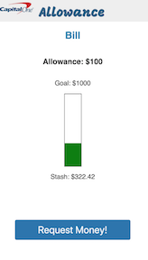

# Anglehack Hackathon at Capital One Seattle
----

### Capital One DevExchange Challenge:

Create the most innovative product that provides value to the company producing the app, the customer, and/or Capital One by utilizing one or more of the below APIs.

Featured API:
Money Movement
APIs: Bank Account Starter, Credit Offers, Rewards

Sponsor Challenges:

Cortana: Best Use of Cortana Skills

TECHNOLOGIES

Featured API:
Money Movement
Transfer money between Capital One bank accounts and externally linked accounts.

Features:
  Retrieve Eligible Accounts
  Request Transfer of Money
  Retrieve All Transfer Details
  Retrieve Single Transfer Details
  Update Transfer Request

This is a practical family-centered savings educational tool app that gives parents the ability to give their kids allowances and monitor savings goals.

Our idea was to make a mobile app that for parents to give an allowance to their kids and help teach saving habits early. A Parent can make a new account for any of their children. The ability to make a Transfer of money at a moments notice is built in.

This Was made for the Capone DevXchange Hackathon

https://www.eventbrite.com/e/capital-one-devexchange-series-seattle-tickets-43226886782?aff=es2

fellow coders were
https://github.com/guitarotronic
https://github.com/ronwthompson
https://github.com/vMarkham
https://github.com/CMunkyDev
